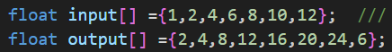
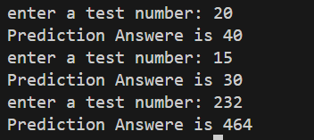

<h2>Simple Machine learning model that satisfies y = 2x </h2>
<h2>It can be improved for harder equations</h2>
<h2>How does it work !?</h2>
<h3>it simply uses this dataset, and tries to make an equation that reproduces the same output</h3>

<h3>Then it can be tested to see how good it predicts the answeres</h3>

<h3>Although the entered numbers are not trained on,  the model predicted the right prediction everytime !</h3>
